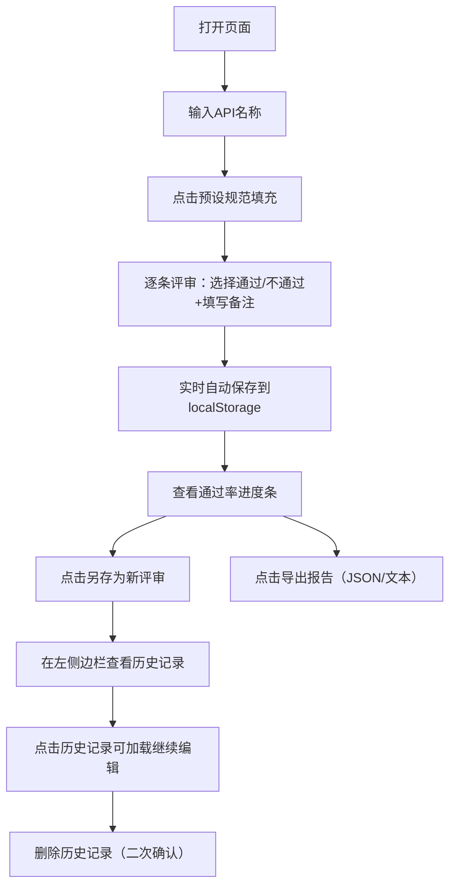

## 1. 产品概述
RESTful API设计评审工具，帮助开发团队系统化地评审API设计规范是否符合最佳实践。通过可视化的评审表格、自动保存、历史记录管理和报告导出功能，提升API设计质量和评审效率。

- 主要用途：API设计规范评审、设计质量检查、评审历史追溯
- 目标用户：后端开发工程师、架构师、技术评审人员
- 产品价值：标准化API评审流程，避免遗漏关键设计点，保留评审历史便于回溯

## 2. 核心功能

### 2.1 用户角色
| 角色 | 注册方式 | 核心权限 |
|------|---------|---------|
| 普通用户 | 无需注册（本地工具） | 完整使用所有功能 |

### 2.2 功能模块
1. **评审主界面**：API名称输入、新建评审、规范表格、通过率进度条
2. **历史记录管理**：左侧边栏历史列表、加载历史、删除历史（二次确认）、另存为新评审
3. **自动保存**：localStorage实时存储评审状态
4. **预设规范**：快速填充RESTful API设计规范示例
5. **报告导出**：导出JSON或文本格式的评审报告

### 2.3 页面详情
| 页面名称 | 模块名称 | 功能描述 |
|---------|---------|----------|
| 主页面 | 顶部操作区 | API名称输入框、新建评审按钮、预设规范填充按钮 |
| 主页面 | 进度展示区 | 评审通过率百分比、彩色进度条动态展示 |
| 主页面 | 评审表格区 | 规范名称、描述、通过/不通过单选组、备注输入框 |
| 主页面 | 左侧边栏 | 历史评审列表、加载/删除操作 |
| 主页面 | 底部操作区 | 另存为新评审按钮、导出报告按钮（JSON/文本） |

## 3. 核心流程
用户打开页面 → 输入API名称 → 选择预设规范或手动添加 → 逐条评审（通过/不通过+备注）→ 实时自动保存 → 查看通过率 → 另存为历史记录 → 导出评审报告

## 4. 用户界面设计

### 4.1 设计风格
- 主色调：深蓝色系（#1e3a8a）代表专业和技术感
- 辅助色：绿色（#10b981）表示通过，红色（#ef4444）表示不通过
- 按钮风格：圆角6px，带有微妙的阴影和hover效果
- 字体：采用现代无衬线字体，标题使用较粗字重，正文清晰易读
- 布局风格：三栏式布局（左侧边栏+主内容区），卡片式设计，层次分明
- 图标：使用lucide-react图标库，保持统一的线性风格

### 4.2 页面设计概述
| 页面名称 | 模块名称 | UI元素 |
|---------|---------|--------|
| 主页面 | 顶部操作区 | 输入框带图标、主按钮蓝色、次按钮灰色边框 |
| 主页面 | 进度展示区 | 渐变进度条、大号百分比数字、统计文字说明 |
| 主页面 | 评审表格区 | 斑马行背景、单选按钮组带颜色区分、备注输入框自适应高度 |
| 主页面 | 左侧边栏 | 历史记录卡片、悬停高亮、删除按钮红色危险提示 |
| 主页面 | 底部操作区 | 操作按钮组、分隔线、页脚信息 |

### 4.3 响应性
- Desktop-first设计，主内容区最小宽度1024px
- 平板端：左侧边栏可折叠，表格横向滚动
- 移动端：单列布局，历史记录改为底部抽屉

### 4.4 交互动效
- 页面加载：元素渐入动画，进度条从0平滑过渡到当前值
- 单选按钮：选择时带有缩放动效和颜色过渡
- 自动保存：右上角显示"已保存"状态提示，淡入淡出
- 历史记录悬停：背景色变化，轻微上浮阴影
- 删除确认：模态框淡入，背景模糊
