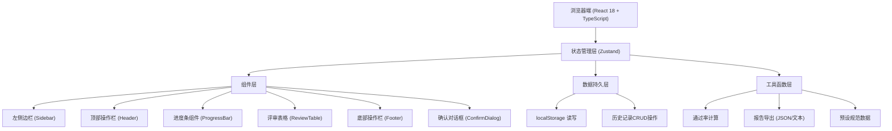
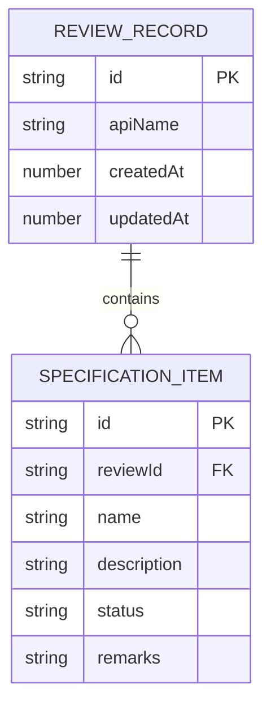

## 1. 架构设计



## 2. 技术描述
- **前端框架**: React@18 + TypeScript + Vite
- **样式方案**: TailwindCSS@3
- **状态管理**: Zustand
- **图标库**: lucide-react
- **数据存储**: localStorage（浏览器本地存储）
- **初始化工具**: vite-init
- **后端**: 无（纯前端应用，所有数据存储在本地）

## 3. 路由定义
| 路由 | 用途 |
|------|------|
| / | 主页面 - API设计评审工具 |

## 4. 数据类型定义

```typescript
// 单个规范项
interface SpecificationItem {
  id: string;
  name: string;
  description: string;
  status: 'pass' | 'fail' | 'pending';
  remarks: string;
}

// 评审记录
interface ReviewRecord {
  id: string;
  apiName: string;
  createdAt: number;
  updatedAt: number;
  specifications: SpecificationItem[];
}

// 评审状态
interface ReviewState {
  currentReview: ReviewRecord | null;
  history: ReviewRecord[];
  autoSave: boolean;
}
```

## 5. 数据模型

### 5.1 数据模型定义


### 5.2 localStorage 存储键
- `api-review-current`: 当前正在编辑的评审
- `api-review-history`: 历史评审记录列表

### 5.3 预设规范数据
包含10+条RESTful API设计最佳实践，涵盖：
- URL命名规范
- HTTP方法使用
- 状态码规范
- 请求/响应格式
- 版本控制
- 分页设计
- 错误处理
- 认证授权
- 文档规范
